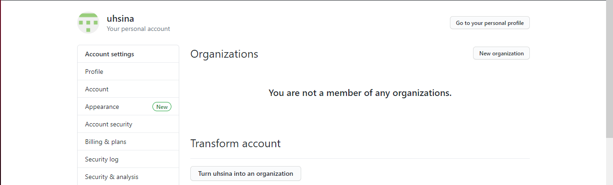
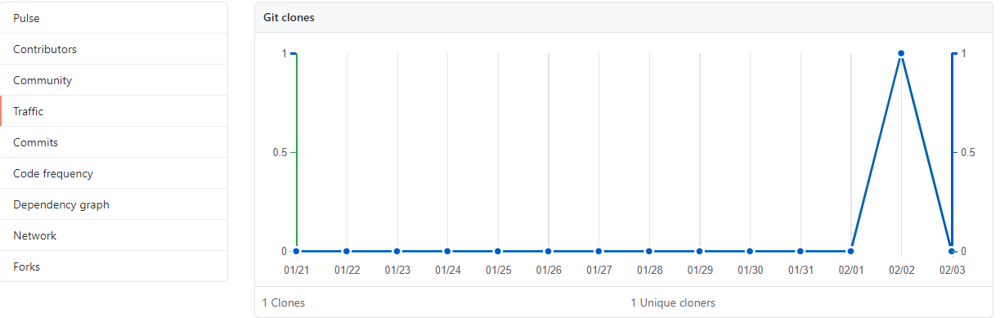
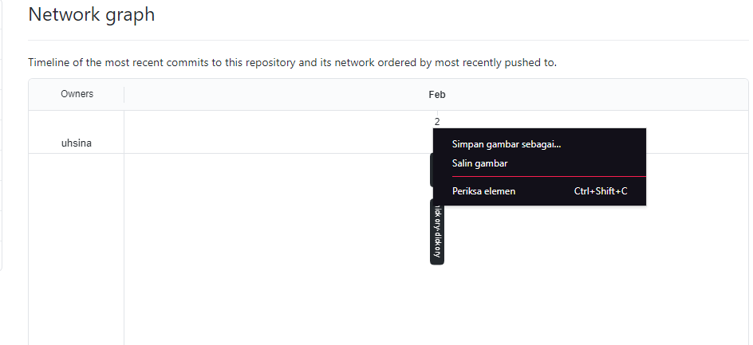
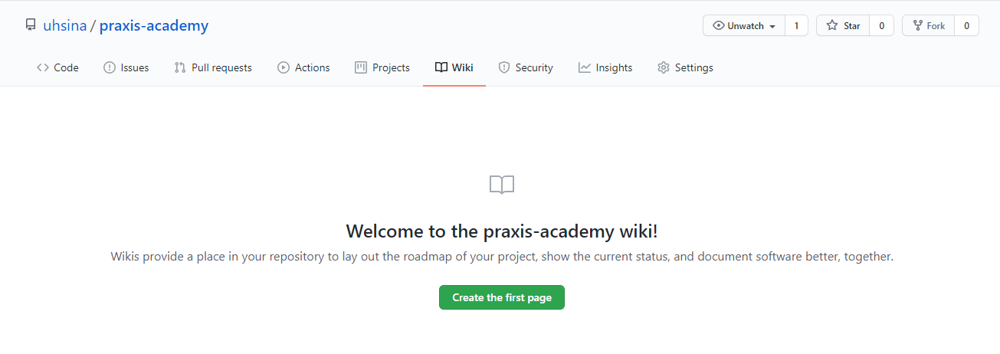

# Team Collaboration With GitHub

1. Adding Team Members - Organization & Collaborators
2. Pull Requests - Sending & Merging
3. Bug Tracking - Github Issues
4. Analytics - Graphs & Network
5. Project Management - Trello & Pivotal Tracker
6. Continuous Integration - Travis CI
7. Code Review - Line Commenting & URL queries
8. Documenting - Wiki & Hubot

## Tool 1: Adding Team Members

Ada 2 cara untuk mengatur Github untuk kolaborasi team:

1. Organizations - Menambahkan organisasi.



Memberikan level akses masing-masing team :

Pull Only: Fetch and Merge with another repository or a local copy. Read only access.
Push and Pull: (1) along with updating of remote repo. Read + Write access.
Push, Pull & Administrative: (1), (2) along with rights to billing info, creating teams as well as canceling Organization accounts. Read + Write + Admin access

1. Menambahkan Collaborators - dengan akses Read + Write access untuk single repository

## Tool 2: Pull Requests

Dua model pull request di Github:

1. **Fork & Pull Model** - Used in a public repository for which we don't have push access
2. **Share Repository Model** - Used in a private repository for which we have push access. Fork is not required is this case.

hasil setelah ditambahkan pull request dengan fork & full model

Menggunakan akses SSH key passphrase dengan memasukkan username dan password setiap melakukan `git push` atau `git pull` dengan langkah sebagai berikut :

```
$ git clone [ssh-url] [folder-name]
$ cd [folder-name]
```

Menambahkan branch baru dengan melakukan modifikasi terhadap file `readme.md` :

```
$ git checkout -b [new-feature]
```

Setelah membuat perubahan, dilakukan commit terhadap perubahan dengan melakukan checkout ke the git master branch

```
$ git add .
$ git commit -m "information added in readme"
$ git checkout master
```

## Tool 3: Bug Tracking

Untuk melakukan bug tracking ada dalam menu Issues

## Tool 4: Analytics

Dua tools yang diberikan didalam repository adalah Graphs dan Network
`https://github.com/[user-name]/[repo]/pulse`
maka akan ditampilkan grafik sebagai berikut


untuk Network ditampilkan sebagai berikut


## Tool 5: Project Management

**Github and Trello**
Open an account in Trello

Go to the Github repository > Settings > Service Hooks > Trello

**Github and Pivotal Tracker**
Create a new project in the Pivotal Tracker with a new Story that needs to be delivered.

Go to Profile > API Token (right at the bottom). Copy the API token given.

Come back to Github repository > Settings > Service Hooks > Pivotal Tracker

## Tool 6: Continuous Integration

**Travis CI with Pull Requests**

## Tool 7: Code Review

Setiap commit Github memungkinkan adanya komentar setiap baris kode, dengan membandingkan menggunakan Compare branches / tags / SHA1 , Compare without whitespace, Diff, Patch dan Line Linking

## Tool 8: Documenting

Dokumentasi digunakan dengan menggunakan Github Wiki untuk membuat dokumentasi dari source code, dapat ditambahkan Github Hubot dan Mentions, Shortcuts & Emoji




